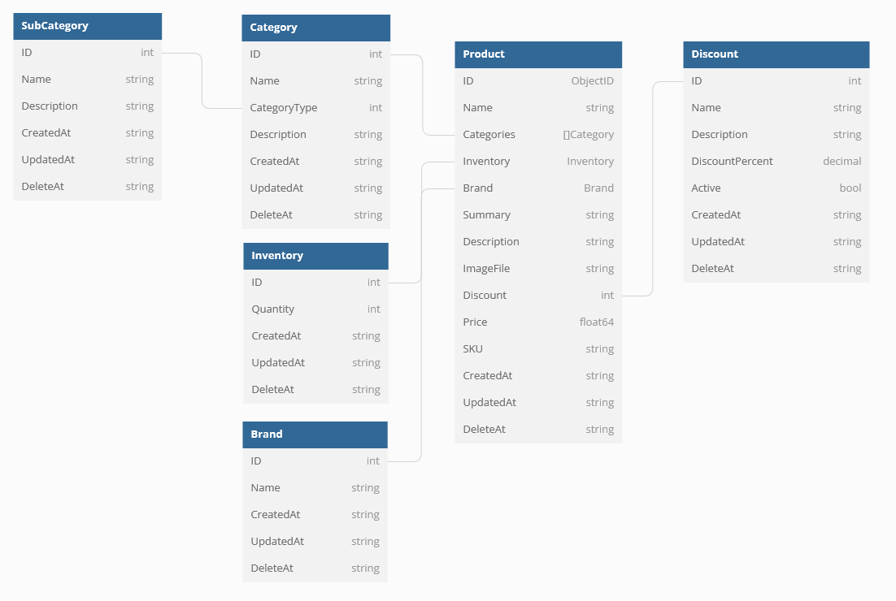

# Introduction
This is a product-api-service version 3. In this version, we will port all the old source to new source using GIN Framework Golang.  
There are a lot of content you need to remember.


# Database Design


# Table of Contents
1. [Part 1: CRUD REST Api on product service.](#part-1-crud-api) 
2. [Part 2: MongoDB](#part-2-monogdb)
3. [Part 3: Design Pattern](#part-3-design-pattern)

### Part 1: CRUD API
* CRUD REST Api on product service.
	- Understand the difference between... [Refer](https://pkg.go.dev/github.com/gin-gonic/gin#readme-parameters-in-path)
		- Parameter in path. [Solution 1](#parameter-in-path)
		- Querystring parameters
		- Multipart/Urlencoded Form
		- Map 
	- create product programmatically. [Refer](https://www.mageplaza.com/devdocs/magento-2-create-product-programmatically.html)
	- Design REST API experience. [Refer](https://developer.adobe.com/commerce/webapi/rest/tutorials/)
* Important terms in e-commerce.
	-  Understand about SKU. [Refer](https://xuatnhapkhauleanh.edu.vn/sku-la-gi-y-nghia-cua-sku-trong-quan-tri-kho-hang.html)
	- REST API, create a product with payload. Refer: [here](https://devdocs.magento.com/guides/v2.4/rest/tutorials/configurable-product/create-simple-products.html)
### Part 2: MonogDB
* Indexes in Mongodb.
	- [Measure time](#measure-time) Measure query time in Mongodb. [Refer](https://viblo.asia/p/tim-hieu-ve-index-trong-mongodb-924lJL4WKPM)
	- [Indexes](#indexes-in-mongodb) How to use Indexes in MongoDB. [Refer](https://viblo.asia/p/su-dung-index-trong-sql-query-1ZnbRlPQR2Xo)

* Experience using NoSQL Database.
	- Building a Hybrid SQL + NoSQL E-Commerce Data Model . Refer: [here](https://dev.to/fabric_commerce/building-a-hybrid-sql-nosql-e-commerce-data-model-3fc3)
	- What's an Example of Good E-Commerce Database Design. Refer: [here](https://dev.to/fabric_commerce/what-s-an-example-of-good-e-commerce-database-design-3e9l)
### Part 3: Design Pattern
* Design Pattern for Product
	- Template for design pattern on product. Refer: [here](https://ui-patterns.com/patterns/ProductPage)
	- [Builder](#design-pattern---builder-for-product) Design pattern for product in microservice. Refer: [here](https://github.com/anhthii/golang-design-pattern)
* Concepts.
	- Difference between Product Types and Product Category. Refer: [here](https://support.sugarcrm.com/Knowledge_Base/Products_Quotes/Product_Types_vs_Product_Categories/)

# Designer
### Measure time
* Step 1: Start Mongodb Shell
```bash
> mongosh
Current Mongosh Log ID: 62f770facd6135a38bfd189f
Connecting to:          mongodb://127.0.0.1:27017/?directConnection=true&serverSelectionTimeoutMS=2000&appName=mongosh+1.5.0
Using MongoDB:          5.0.7
Using Mongosh:          1.5.0
......................................

```
* Step 2: Connect to collection, and use your db
```
> show dbs
> use go-microservice
```

* Step 3: Show collection
```
> show collections
```
* Step 4: insert the sample data
```s
> use test     // Use database test to insert the sample data
    for(var i = 0; i < 1000000; i++) {
        db.users.insert({
            i: i,
            username: 'user' + i,
            age: Math.floor(Math.random() * 100)
        });
    }
```
* Step 4: query to find your document
```s
> db.users.find({username: 'user112'}).explain("executionStats")["executionStats"]
{
	"executionSuccess" : true,
	"nReturned" : 1,
	"executionTimeMillis" : 269,
	"totalKeysExamined" : 0,
	"totalDocsExamined" : 1000000,
	"executionStages" : {
		"stage" : "COLLSCAN",
		"filter" : {
			"username" : {
				"$eq" : "user112"
			}
		},
		"nReturned" : 1,
		"executionTimeMillisEstimate" : 211,
		"works" : 1000002,
		"advanced" : 1,
		"needTime" : 1000000,
		"needYield" : 0,
		"saveState" : 7813,
		"restoreState" : 7813,
		"isEOF" : 1,
		"invalidates" : 0,
		"direction" : "forward",
		"docsExamined" : 1000000
	}
}
```
### Indexes in MongoDB.
* Step 1: Create indexes, and check indexes
```s
> db.users.createIndex({username: 1}) // Đánh index cho username theo thứ tự tăng dần, -1 là giảm dần.

# Check your indexes
> db.users.getIndexes() // Xem index nào đã có.
```
* Step 2: Check time after create indexes
```s
> db.users.find({username: 'user112'}).explain("executionStats")["executionStats"]
```

### Design Pattern - Builder for product.