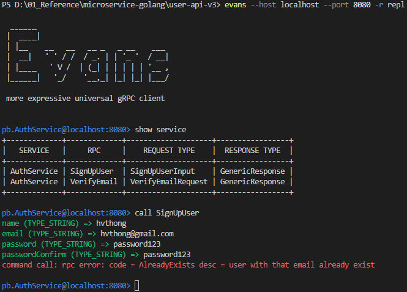

# Getting Started
1. Run swagger to generate swagger documents.
```
swag init
```
Refer: [here](https://github.com/swaggo/gin-swagger)
2. Build source 
```
go build
```
3. Open swagger.
```

```

# Reference
CRUD RESTful API with Golang + MongoDB + Redis + Gin Gonic
#### Part 1
* API with Golang + MongoDB + Redis + Gin Gonic: Project Setup
    - API with Golang + MongoDB + Redis + Gin Gonic: Project Setup. [Refer](https://codevoweb.com/api-golang-mongodb-gin-gonic-project-setup)
	- Understand about method to design. [Refer](https://blog.logrocket.com/building-microservices-go-gin/)

#### Part 2
* Golang & MongoDB: JWT Authentication and Authorization
    - Golang & MongoDB: JWT Authentication and Authorization. [Refer](https://codevoweb.com/golang-mongodb-jwt-authentication-authorization)
    - [MongoDB ObjectID](#solution-for-design-object-id) To create a object ID from Primitive.  [Refer](https://kb.objectrocket.com/mongo-db/how-to-find-a-mongodb-document-by-its-bson-objectid-using-golang-452)
	- [Middleware](#middleware-for-authorization) Design middleware for authorizing access token. [Refer]
	- [Refresh Token](#work-flow-for-implementation-of-refresh-token) Understand how to implement refresh token. 
    - [Login Attempt](#solution-for-login-attempt) Design feature login attempt in Golang. [Refer](https://www.stackhawk.com/blog/golang-broken-authentication-guide-examples-and-prevention/)
#### Part 3
* API with Golang + MongoDB: Send HTML Emails with Gomail
    - API with Golang + MongoDB: Send HTML Emails with Gomail. [Refer](https://codevoweb.com/api-golang-mongodb-send-html-emails-gomail)
	- [Solution](#solution-to-use-a-temporary-to-store-verification-code-from-email) How to use temporary in MongoDB. 


#### Part 4
* API with Golang, Gin Gonic & MongoDB: Forget/Reset Password
    - API with Golang, Gin Gonic & MongoDB: Forget/Reset Password. [Refer](https://codevoweb.com/api-golang-gin-gonic-mongodb-forget-reset-password)
	- [gRPC](#solution-to-use-email-grpc-server) Step to design, implement and use gRPC email server.
	- [Evans](#solution-to-use-evans-for-testing-grpc) How to use evans for testing email grpc on server. [Refer](https://github.com/ktr0731/evans#installation)

#### Part 5
* Build Golang gRPC Server and Client: SignUp User & Verify Email
    - Build Golang gRPC Server and Client: SignUp User & Verify Email. [Refer](https://codevoweb.com/golang-grpc-server-and-client-signup-user-verify-email)

#### Part 6
* Build Golang gRPC Server and Client: Access & Refresh Tokens
    - Build Golang gRPC Server and Client: Access & Refresh Tokens. [Refer](https://codevoweb.com/golang-grpc-server-and-client-access-refresh-tokens)

#### Part 7
* Build CRUD RESTful API Server with Golang, Gin, and MongoDB
    - Build CRUD RESTful API Server with Golang, Gin, and MongoDB. [Refer](https://codevoweb.com/crud-restful-api-server-with-golang-and-mongodb)

#### Part 8
* Build CRUD gRPC Server API & Client with Golang and MongoDB
    - Build CRUD gRPC Server API & Client with Golang and MongoDB. [Refer](https://codevoweb.com/crud-grpc-server-api-client-with-golang-and-mongodb)

#### Part 9
* Google OAuth Authentication React.js, MongoDB and Golang
    - Google OAuth Authentication React.js, MongoDB and Golang.  [Refer](https://codevoweb.com/google-oauth-authentication-react-mongodb-and-golang)

# Getting Started
### Import data for MongoDB
* Sample data. Refer: [here](https://github.com/talenteddeveloper/mongo_sample_dataset)
```

```
### Build project
* Start docker
```
docker-compose up -d
```
* Build user service source
```
./go build
```
* Start service
```
./user-api-v3.exe
```
# Designer
### Middleware for authorization
```go
// Step 1: User login, and provide access token to cookie
	ctx.SetCookie("access_token", access_token, config.AccessTokenMaxAge*60, "/", "localhost", false, true)

// Step 2: For each controller want to authorize user, we will use this middleware
	router.Use(middleware.DeserializeUser(userService))

// Step 3: Get cookie to check user login or not
	if access_token == "" {
		ctx.AbortWithStatusJSON(http.StatusUnauthorized, gin.H{"status": "fail", "message": "You are not logged in"})
		return
	}

// Step 4: If user login success, access_token was stored in cookie, then we will decode jwt token
	sub, err := utils.ValidateToken(access_token, config.AccessTokenPublicKey)

// Step 5: If decode success, we will get id user from claims jwt token.
	user, err := userService.FindUserById(fmt.Sprint(sub))

// Step 6: store the current user to cookie
	ctx.Set("currentUser", user)
```
### Solution for design object ID
At file: [auth.service.impl.go](./services/auth.service.impl.go).  

**Design 1:** If you want to insert document to collection, then insert object ID for your document.
```go
// Step 1: Insert document without objectID
	res, err := uc.collection.InsertOne(uc.ctx, &user)

// Step 2: get response and then insert ID
	query := bson.M{"_id": res.InsertedID}

// Step 3: find your result
	err = uc.collection.FindOne(uc.ctx, query).Decode(&newUser)
```
**Design 2:** If you want to setting objectID in user.model.go, and generate objectID, then insertOne to DB.
```go
// Step 1: Define a new objectID
	user.ID = primitive.NewObjectID()

// Step 2: Insert to db
	_, err := uc.collection.InsertOne(uc.ctx, &user)

// Step 3: make a query command.
	query := bson.M{"_id": user.ID}

// Step 4: find your result
    err = uc.collection.FindOne(uc.ctx, query).Decode(&newUser)
```
### Work flow for implementation of refresh token
From requirement, design protobuf for email server
```go
// Step 1: At SignInUser controller, when user login success.
// 		+ we will set access token, refresh token by our private key with the expired time 
// 		+ then we also set max age for each token.
// 		+ Difference between expire and max age. Refer: (https://www.mnot.net/blog/2007/05/15/expires_max-age)
	ctx.SetCookie("access_token", access_token, config.AccessTokenMaxAge*60, "/", "localhost", false, true)
	ctx.SetCookie("refresh_token", refresh_token, config.RefreshTokenMaxAge*60, "/", "localhost", false, true)
	ctx.SetCookie("logged_in", "true", config.AccessTokenMaxAge*60, "/", "localhost", false, false)

// Step 2: At RefreshAccessToken controller, we will get refresh token, and validate access token. And update access token again.

```
* Note:  
	- The access token can be refreshed after every 15 minutes as long as the user has a valid refresh token. This approach is not the best so later we’ll integrate Redis for an extra layer of security. 

### Solution for login attempt

### Solution to use a temporary to store verification code from email
#### Requirement
- We need to implement feature to verify email from users once they register a new account.
- We will generate a verification code and send email to users.
- Once you generate a code, you will store it a temporary table in MongoDB, and after user verified successfully, we will delete it.
- Security: need to make sure the verification code is hacked by another source.
#### Design
At file: [auth.controller.go](./controllers/auth.controller.go).  
```go
// Step 1: User register a new account, then we will generate code send to email.
	code := randstr.String(20)
	verificationCode := utils.Encode(code)

// Step 2: After getting code, we will store it in temporary table
    ac.userService.UpdateUserById(newUser.ID.Hex(), "verificationCode", verificationCode)
    
// Step 3: In service, we will UpdateOne() to insert verifycode in table
	userId, _ := primitive.ObjectIDFromHex(id)
	query := bson.D{{Key: "_id", Value: userId}}
	update := bson.D{{Key: "$set", Value: bson.D{{Key: field, Value: value}}}}
	result, err := uc.collection.UpdateOne(uc.ctx, query, update)

// Step 4: Call verifyemail() API to verify email from code, and delete temporary table by using unset keyword.
	verificationCode := utils.Encode(code)

	query := bson.D{{Key: "verificationCode", Value: verificationCode}}
	update := bson.D{{Key: "$set", Value: bson.D{{Key: "verified", Value: true}}}, {Key: "$unset", Value: bson.D{{Key: "verificationCode", Value: ""}}}}
	result, err := ac.collection.UpdateOne(ac.ctx, query, update)
```

### Solution to use email gRPC server


### Solution to use Evans for testing gRPC
#### Requirement
* Install evans to your local machine
* Then is enable [gRPC reflection](https://github.com/grpc/grpc/blob/master/doc/server-reflection.md) on server side following the below code.
```
	reflection.Register(grpcServer)
```
#### Getting Started
* Start evans with your gRPC
```
evans --host localhost --port 8080 -r repl
```
* Show service
* Call API.  
#### More details

