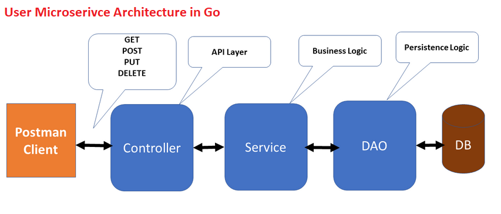

# Introduction
This user-api folder is a user microservice. It include some below feautures:
* Understand about user access to DB.
* Understand about RESTfull API
* Apply Singleton design pattern for DB.
* Understand how to authenticate user with JWT

# Architecture


# Questions
* How do you implement CRUB API with RESTful?
* How do you open MongoDB Driver on local machine?
* When you need to generate JWT Token for a user?
* How do you enable logger for GIN Framework? or Server? What the difference of them?
* In building-microservice-go book, Chapter 8: Security, it remind that we never storing passwords in plain text in a datastore. How do you implement this feature? Refer: [here](#hashing-password)
* Implement **Unit Test** with Gin framework? Refer: [here](https://circleci.com/blog/gin-gonic-testing/)
* Implement OAuth2 Google with GIN framework. Refer: [here]

# Project Structure
```
├───common
├───config
├───controllers
├───daos
├───databases
├───logs
├───models
├───payload
├───security
└───utils
```
Those folders contain:
* **common:** handle common task such as setting logger, filter config ...
* **config:** configuration for project such as logger, mongodb, jwt...
* **controllers:** where to expose RESTful API for client.
* **daos:** where data access to object on mongoDB.
* **databases:** storage for DB.
* **logs:** log file.
* **models:** corresponds to all the data-related logic that the user works with.
* **payload:** contain message request/response.
* **security:** contain authentication getting from user.
* **utils:** implement some utilities for server

# Design Database for User microservice
* This db is designed for improve user service in the future.


## Getting Started


## Test server
To understand this service, please test server with APIs below
### Login With User
Authenticate with your User.  


### Register a new User
Register a new user.  


### Use CRUD API from server
Khi xây dựng các API, các mô hình cung cấp bốn loại chức năng cơ bản. Mô hình phải có khả năng **Create, Read, Update, và Delete** tài nguyên. Các nhà khoa học máy tính thường gọi tên các các chức năng này bằng từ viết tắt CRUD. Qua đó, ta có các API như sau:
1. To read all users from server. Refer: [ListUsers](#get-list-of-users)
2. Other, please refer to source.
#### Get list of users
From token that we get from [Authenticate](#login-with-user), insert to Postman, and call **ListUsers()**.  


## Answer Questions
### Hashing password
**bcrypt** is another popular method of hashing passwords.  
1. To hash a password with bcrypt we use the **GenerateFromPassword()** method:
```go
func Hash(password string) (string, error) {
    // hass password using bcrypt
	bytes, err := bcrypt.GenerateFromPassword([]byte(password), 14)
	return string(bytes), err
}
```

2. To check the equality of a bcrypt hash we can not call **GenerateFromPassword()** again with the given password and compare the output to the hash we have stored as **GenerateFromPassword()** will create a different hash every time it is run. To compare equality we need to use the **CompareHashAndPassword()** method:
```go
func CheckPasswordHash(hashedPassword, password string) error {
	return bcrypt.CompareHashAndPassword([]byte(hashedPassword), []byte(password))
}
```

3. To avoid SQL injection error, we can implement **Santize()** function
```go
func Santize(data string) string{
	data = html.EscapeString(strings.TrimSpace(data))
	return data
}
```
More details:
* About hacking with SQL injection. Refer: [here](https://www.meisternote.com/app/note/uMUTsPEJzQbx/sql-injection)
* About implementing login with hash password. Refer: [here](https://www.meisternote.com/app/note/MKInhQGqLw4m/security-for-login)
### Google OAuth2 
* More details documents: [here](https://skarlso.github.io/2016/06/12/google-signin-with-go/#setup---oauth-client)
* More details source code reference: [here](https://github.com/Skarlso/google-oauth-go-sample)
#### Step 1: Set up Credentials
```go
// Credentials which stores google ids.
type Credentials struct {
    Cid string `json:"cid"`
    Csecret string `json:"csecret"`
}

func init() {
    var c Credentials
    file, err := ioutil.ReadFile("./creds.json")
    if err != nil {
        fmt.Printf("File error: %v\n", err)
        os.Exit(1)
    }
    json.Unmarshal(file, &c)
}
```
We will implement it at the common folder.

